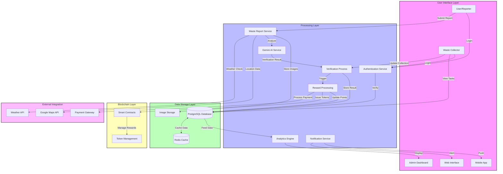
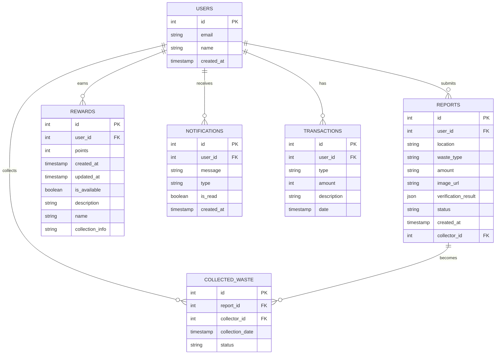

# Eco Swachh - Digital Waste Management Platform

[](LICENSE)
[](https://nextjs.org/)
[](https://www.typescriptlang.org/)
[](https://orm.drizzle.team/)
[](https://web3auth.io/)

Eco Swachh is an innovative digital platform that transforms waste management under the Swachh Bharat initiative, leveraging AI and blockchain technology for a cleaner, sustainable India.

## 📋 Table of Contents

- [Features](#-features)
- [Architecture](#-architecture)
- [Tech Stack](#-tech-stack)
- [Prerequisites](#-prerequisites)
- [Installation](#-installation)
- [Project Structure](#-project-structure)
- [API Documentation](#-api-documentation)
- [Contributing](#-contributing)
- [License](#-license)

## 🚀 Features

### For Users
- 📱 Real-time waste reporting with location tracking
- 🤖 AI-powered waste verification using Google Gemini
- 💰 Reward points system for waste management contributions
- 📊 Personal dashboard with waste reporting history
- 🎯 Leaderboard for community engagement

### For Collectors
- 🗺️ Location-based waste collection task management
- ✅ Verification system for completed collections
- 📸 Photo evidence submission and AI verification
- 💎 Token rewards for verified collections

### For Platform
- 📊 Analytics dashboard for waste management insights
- 🔄 Automated reward distribution system
- 🌐 Blockchain-based transaction tracking
- 📱 Progressive Web App capabilities

## 🏗 Architecture

### Data Flow Diagram



### Entity-Relationship Diagram



## 🛠️ Tech Stack

### Frontend Technologies
- **Next.js 14** - React framework with server-side rendering
- **TypeScript** - Static type checking
- **Tailwind CSS** - Utility-first styling
- **Lucide Icons** - Modern icon library
- **React Hook Form** - Form validation
- **@react-google-maps/api** - Google Maps integration
- **Toast** - User notifications

### Backend & Database
- **Drizzle ORM** - Type-safe database operations
- **PostgreSQL** - Primary database (via Neon)
- **Google AI (Gemini)** - AI-powered waste verification
- **Web3Auth** - Decentralized authentication
- **Razorpay** - Payment processing

### Development & DevOps
- **ESLint** - Code linting
- **Prettier** - Code formatting
- **Husky** - Git hooks
- **GitHub Actions** - CI/CD pipeline

## 📋 Prerequisites

- Node.js 18.0 or later
- PostgreSQL database
- Google Cloud Platform account with Gemini API enabled
- Web3Auth account
- Razorpay account (for donations)

## 🚀 Installation

1. Clone the repository:
```bash
git clone https://github.com/yourusername/eco-swachh.git
cd eco-swachh
```

2. Install dependencies:
```bash
npm install
```

3. Set up environment variables:
```bash
cp .env.example .env.local
```

4. Configure environment variables:
```env
DATABASE_URL=your_postgres_url
NEXT_PUBLIC_GOOGLE_MAPS_API_KEY=your_google_maps_key
NEXT_PUBLIC_GEMINI_API_KEY=your_gemini_key
NEXT_PUBLIC_WEB3AUTH_CLIENT_ID=your_web3auth_id
RAZORPAY_KEY_ID=your_razorpay_key
RAZORPAY_KEY_SECRET=your_razorpay_secret
```

5. Initialize the database:
```bash
npm run db:push
```

6. Start the development server:
```bash
npm run dev
```

## 🏗️ Project Structure

```
eco-swachh/
├── app/                    # Next.js app directory
│   ├── api/               # API routes
│   ├── collect/          # Waste collection module
│   ├── report/           # Waste reporting module
│   └── rewards/          # Rewards management
├── components/            # Reusable React components
├── lib/                   # Utility functions
├── public/               # Static files
├── styles/               # Global styles
├── types/                # TypeScript definitions
└── utils/
    └── db/               # Database operations
```

## 📚 API Documentation

### Waste Management Endpoints

```typescript
POST /api/reports
GET /api/reports
POST /api/collect
POST /api/verify
GET /api/rewards
```

### Authentication Endpoints

```typescript
POST /api/auth/login
POST /api/auth/logout
GET /api/auth/user
```

## 🤝 Contributing

1. Fork the repository
2. Create your feature branch (`git checkout -b feature/amazing-feature`)
3. Commit changes (`git commit -am 'Add amazing feature'`)
4. Push to branch (`git push origin feature/amazing-feature`)
5. Open a Pull Request

## 📄 License

This project is licensed under the MIT License - see the [LICENSE](LICENSE) file for details.

## 🙏 Acknowledgments

- Next.js team for the amazing framework
- Drizzle ORM team for the database toolkit
- Web3Auth for decentralized authentication
- Google Cloud Platform for AI services

## 📞 Contact

- Project Link: [https://github.com/yourusername/eco-swachh](https://github.com/yourusername/eco-swachh)
- Documentation: [https://docs.eco-swachh.com](https://docs.eco-swachh.com)

---

Built with 💚 for a cleaner India | © 2024 Eco Swachh
