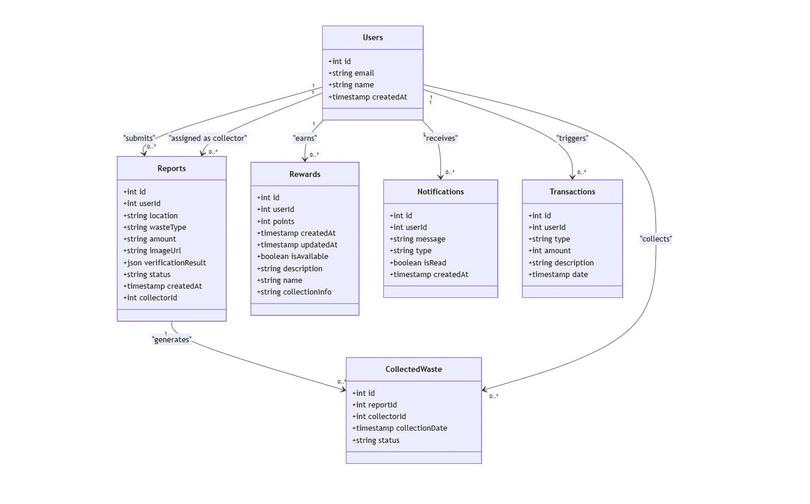

# Eco Swachh - Digital Waste Management Platform

[](LICENSE)
[](https://nextjs.org/)
[](https://www.typescriptlang.org/)

Eco Swachh is an innovative digital platform that transforms waste management under the Swachh Bharat initiative, leveraging blockchain technology and AI for a cleaner, sustainable India.

## 🚀 Features

- 📱 Real-time waste reporting with AI verification
- 🗺️ Location-based waste collection tracking
- 💰 Reward system for waste management contributions
- 🤖 AI-powered waste classification
- 📊 Analytics dashboard for waste management insights

## 🛠️ Tech Stack

### Frontend

- **Next.js 15** - React framework for production-grade applications
- **TypeScript** - Static type checking and enhanced developer experience
- **Tailwind CSS** - Utility-first CSS framework
- **React Hook Form** - Form validation and handling
- **@react-google-maps/api** - Google Maps integration

### Backend & Database

- **Drizzle ORM** - TypeScript ORM for SQL databases
- **PostgreSQL** - Primary database (via Neon)
- **Google AI (Gemini)** - AI-powered waste verification

### Authentication & Web3

- **Web3Auth** - Decentralized authentication
- **Ethereum Provider** - Blockchain integration

## 📋 Prerequisites

- Node.js 18.0 or later
- PostgreSQL database
- Google Cloud Platform account
- Web3Auth account

## 🚀 Getting Started

1. Clone the repository

```bash
git clone https://github.com/yourusername/eco-swachh.git
```

2. Install dependencies

```bash
cd eco-swachh
npm install
```

3. Set up environment variables

```bash
cp .env.example .env.local
```

4. Start the development server

```bash
npm run dev
```

## 🏗️ Project Structure

```
eco-swachh/
├── app/                    # Next.js app directory
│   ├── page.tsx           # Home page
│   └── report/            # Waste reporting module
├── components/            # Reusable React components
├── public/
│   └── diagrams/         # Project diagrams
├── utils/
│   └── db/               # Database configurations
│       ├── actions.ts    # Database operations
│       └── schema.ts     # Database schema
└── types/                # TypeScript type definitions
```

## 📊 Architecture Diagrams

### Data Flow Diagram


### Class Diagram



### Sequence Diagram


### ER Diagram


## 🤝 Contributing

We welcome contributions!

1. Fork the repository
2. Create your feature branch (`git checkout -b feature/amazing-feature`)
3. Commit your changes (`git commit -m 'Add amazing feature'`)
4. Push to the branch (`git push origin feature/amazing-feature`)
5. Open a Pull Request

## 📝 Code of Conduct

Please read our [Code of Conduct](CODE_OF_CONDUCT.md) before contributing.

## 📄 License

This project is licensed under the MIT License - see the [LICENSE](LICENSE) file for details.

## 🙏 Acknowledgments

- [Next.js Team](https://nextjs.org)
- [Drizzle ORM](https://orm.drizzle.team)
- [Web3Auth](https://web3auth.io)
- [Google Cloud Platform](https://cloud.google.com)

## 📞 Contact

- Project Link: [https://github.com/yourusername/eco-swachh](https://github.com/yourusername/eco-swachh)

---

Built with 💚 for a cleaner India
