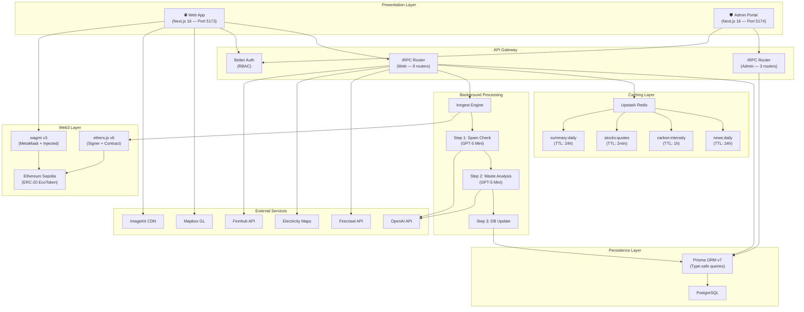
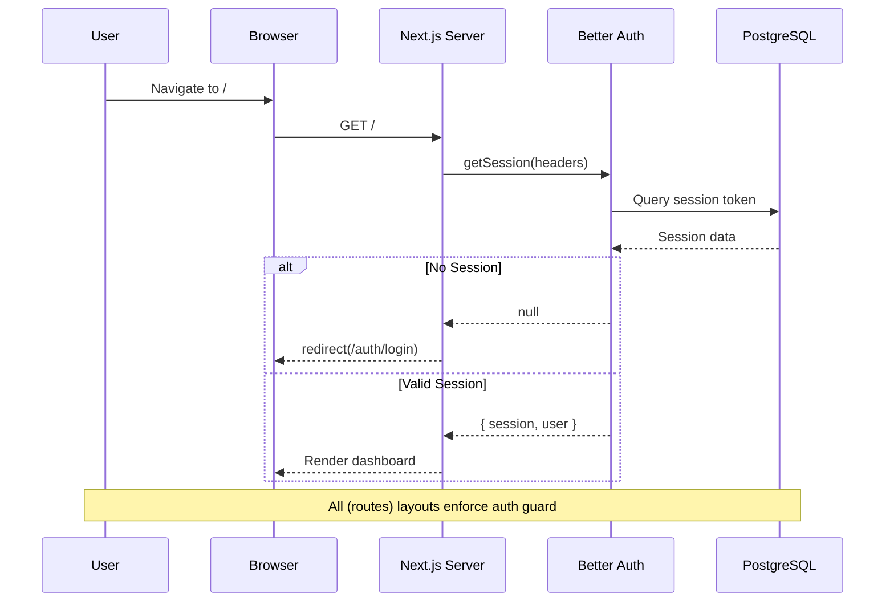
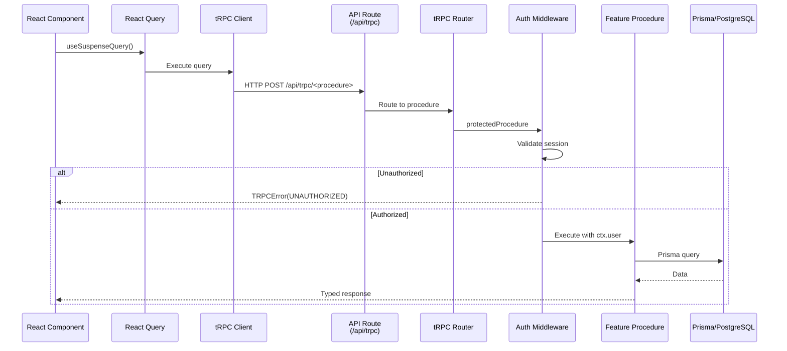
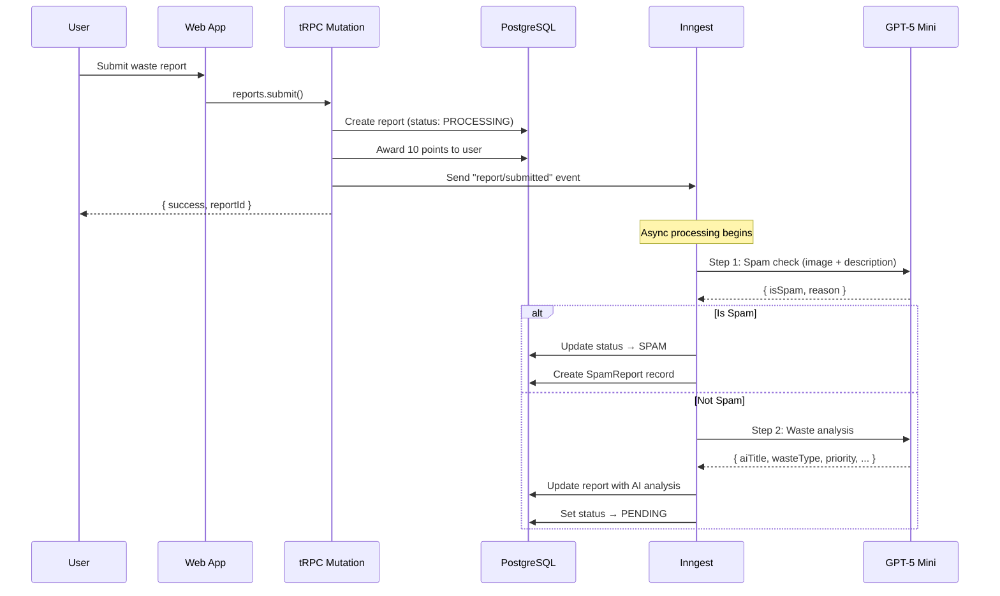
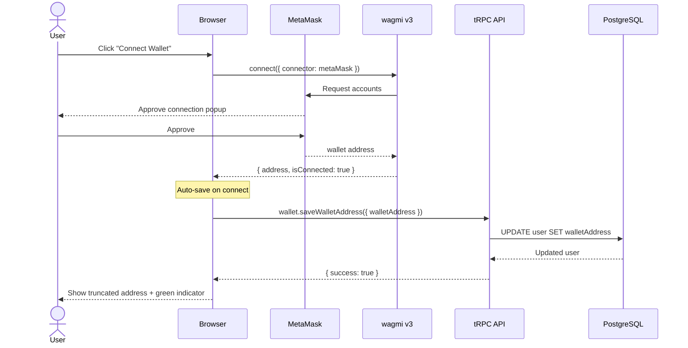
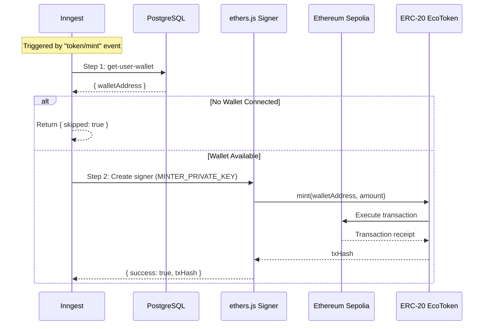

# 🏛️ Architecture Overview

EcoSwachh follows a **monorepo-first, feature-sliced** architecture built on top of Turborepo. The system is split into two independent Next.js applications (user-facing web app and admin portal) that consume shared internal packages for database access, UI components, and tooling configuration.

---

## High-Level System Architecture



---

## Application Architecture Patterns

### 1. Feature-Sliced Design

Each feature is organized as a self-contained vertical slice under `features/`:

```
features/<feature-name>/
├── server/          # tRPC procedures (backend logic)
├── ui/              # React components (frontend)
├── hooks/           # Feature-specific React hooks
└── prompts/         # AI prompt templates (if applicable)
```

This ensures features are independently maintainable and testable. Each slice owns its server procedures, its UI components, and any AI prompts it needs.

### 2. Data Access Layer (DAL)

The DAL is located at `dal/` in each app and manages the tRPC stack:

```
dal/
├── init.ts           # tRPC initialization, context creation, middleware
├── routers/_app.ts   # Root router composing all feature routers
├── client.tsx        # TRPCReactProvider with React Query integration
├── server.tsx        # Server-side tRPC caller for SSR prefetching
└── query-client.ts   # TanStack Query client factory
```

**Key design decisions:**
- `createTRPCContext` uses `cache()` from React for request deduplication
- `protectedProcedure` middleware enforces authentication
- `superjson` transformer enables proper serialization of Dates, Maps, etc.

### 3. Server-Side Prefetching

Pages use a consistent prefetching pattern for optimal performance:

```tsx
// Server Component (page.tsx)
export default async function Page() {
  const queryClient = getQueryClient();
  void queryClient.prefetchQuery(trpc.feature.getData.queryOptions());

  return (
    <HydrationBoundary state={dehydrate(queryClient)}>
      <ErrorBoundary fallback={<ErrorComponent />}>
        <Suspense fallback={<LoadingComponent />}>
          <ClientComponent />
        </Suspense>
      </ErrorBoundary>
    </HydrationBoundary>
  );
}
```

### 4. Authentication Flow



---

## Request-Response Flow

### tRPC Request Lifecycle



---

## Background Job Pipeline (Report Processing)



---

## Caching Strategy

| Cache Key | TTL | Source API | Invalidation |
|---|---|---|---|
| `news:daily` | 24 hours | Firecrawl | Time-based expiry |
| `summary:daily` | 24 hours | OpenAI (web search) | Time-based expiry |
| `carbon:intensity` | 1 hour | Electricity Maps | Time-based expiry |
| `stocks:quotes` | 2 minutes | Finnhub | Time-based expiry |

All caching is handled through **Upstash Redis** with a read-through caching pattern:
1. Check Redis for cached data
2. If hit → parse and return
3. If miss → fetch from external API → cache in Redis → return

---

## Security Architecture

| Layer | Mechanism |
|---|---|
| **Authentication** | Better Auth with secure HTTP-only session cookies |
| **Authorization** | tRPC middleware (`protectedProcedure`) validates session on every request |
| **Admin RBAC** | Admin procedures check `ctx.user.role === "admin"` |
| **Input Validation** | Zod schemas on all tRPC inputs |
| **CSRF Protection** | Cookie-prefix scoping (`web` vs `admin`) |
| **Spam Prevention** | AI-powered spam detection on report submissions |
| **User Moderation** | Admin can ban/unban users with reason tracking |

---

## Web3 Wallet Connection Flow



## EcoToken Minting Pipeline


