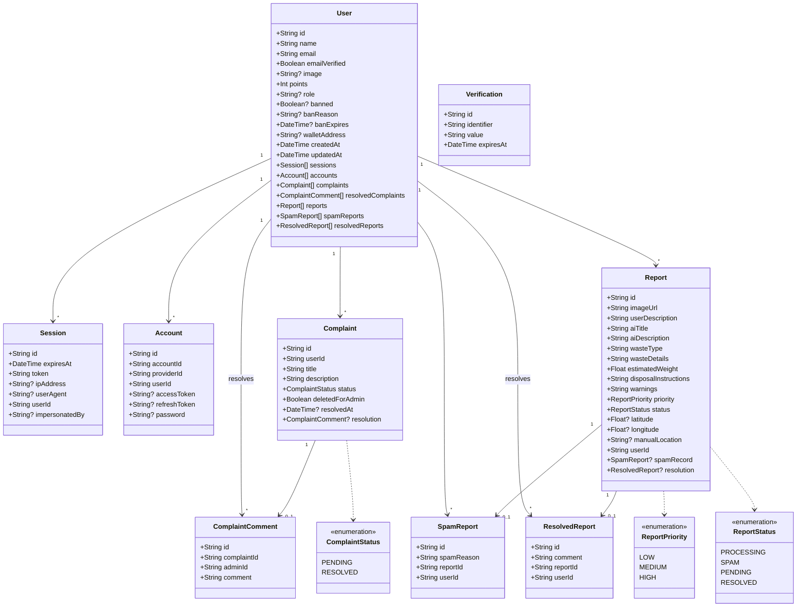
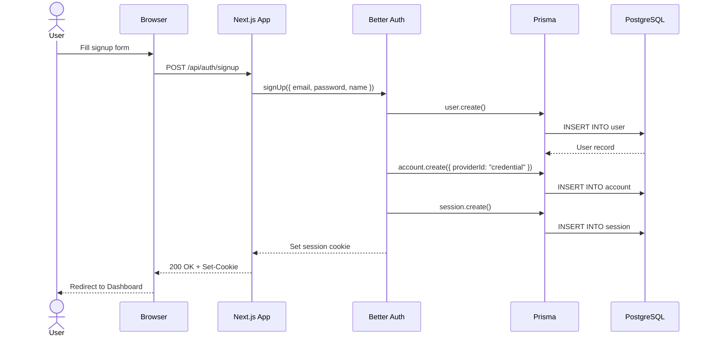
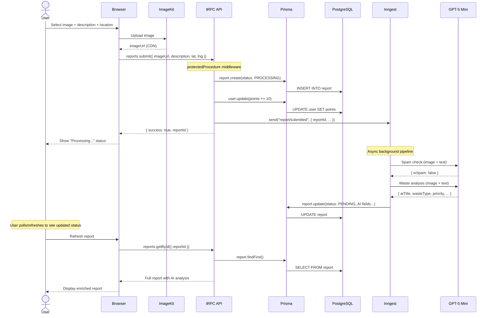
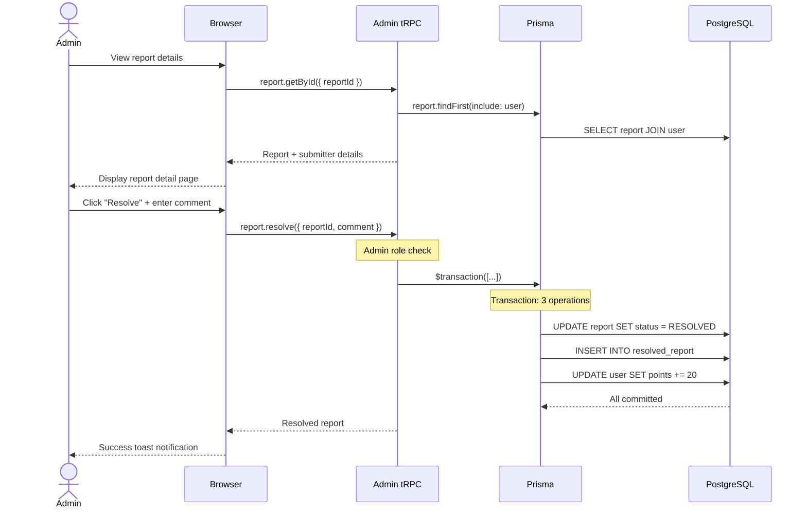
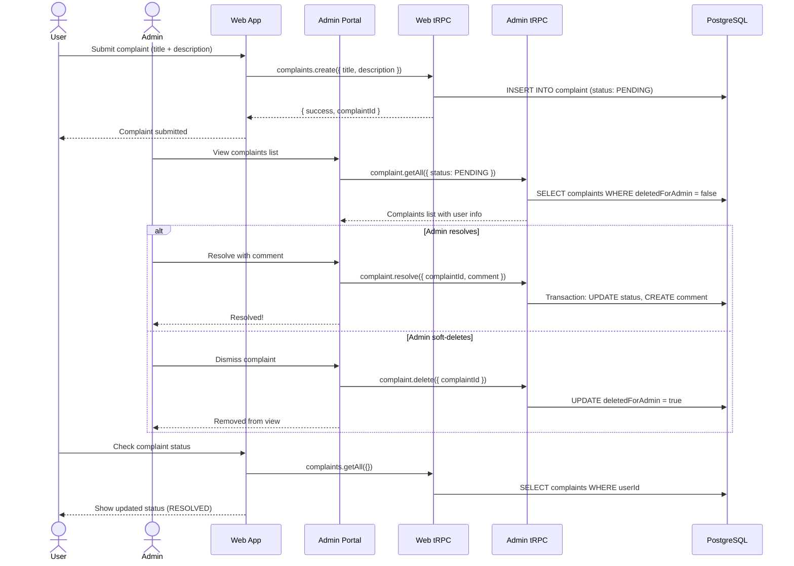
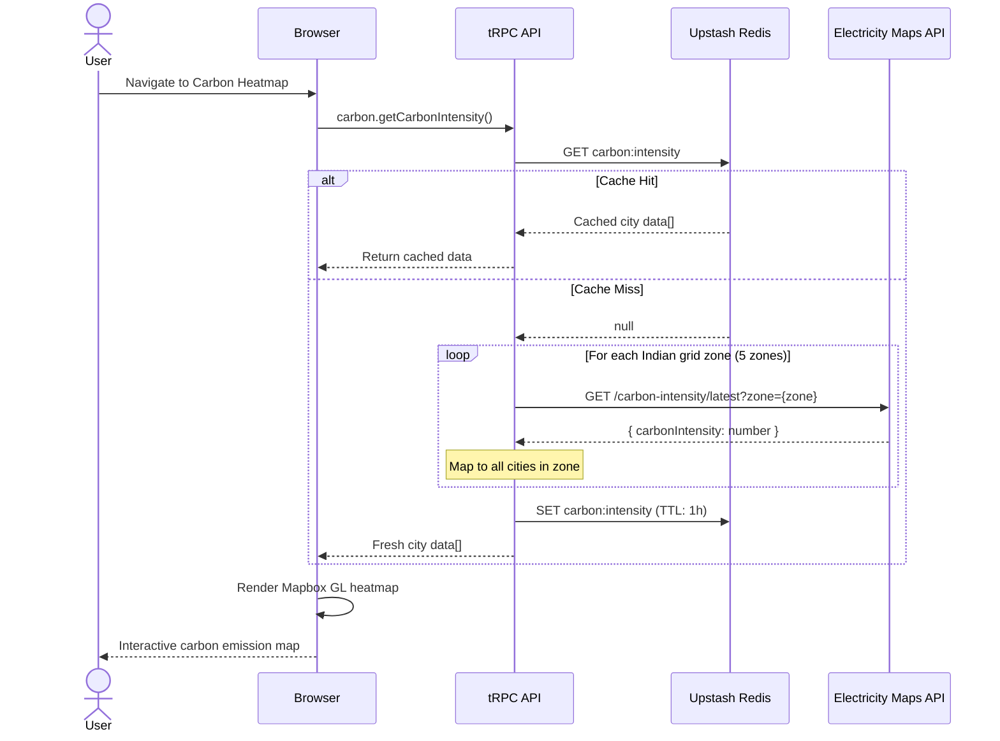
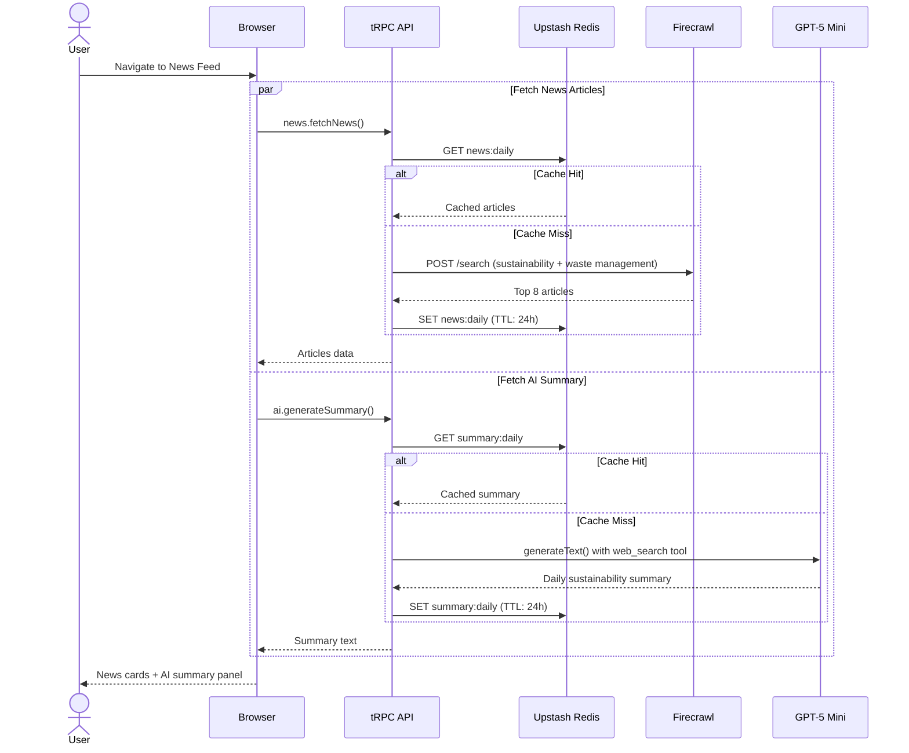

# 📊 Database Design & Diagrams

This document covers the complete database schema, entity relationships, class diagrams, and data flow sequences for the EcoSwachh platform.

---

## Entity-Relationship Diagram (ERD)

```mermaid
erDiagram
    User ||--o{ Session : "authenticates via"
    User ||--o{ Account : "has provider"
    User ||--o{ Complaint : "submits"
    User ||--o{ ComplaintComment : "resolves as admin"
    User ||--o{ Report : "submits"
    User ||--o{ SpamReport : "flagged for"
    User ||--o{ ResolvedReport : "resolved by admin"
    Complaint ||--o| ComplaintComment : "resolved with"
    Report ||--o| SpamReport : "flagged as spam"
    Report ||--o| ResolvedReport : "resolved with"

    User {
        String id PK
        String name
        String email UK
        Boolean emailVerified
        String image
        Int points
        String role "user | admin"
        Boolean banned
        String banReason
        DateTime banExpires
        String walletAddress "optional Ethereum 0x address"
        DateTime createdAt
        DateTime updatedAt
    }

    Session {
        String id PK
        DateTime expiresAt
        String token UK
        String ipAddress
        String userAgent
        String userId FK
        String impersonatedBy
        DateTime createdAt
        DateTime updatedAt
    }

    Account {
        String id PK
        String accountId
        String providerId
        String userId FK
        String accessToken
        String refreshToken
        String idToken
        DateTime accessTokenExpiresAt
        DateTime refreshTokenExpiresAt
        String scope
        String password "hashed"
        DateTime createdAt
        DateTime updatedAt
    }

    Verification {
        String id PK
        String identifier
        String value
        DateTime expiresAt
        DateTime createdAt
        DateTime updatedAt
    }

    Complaint {
        String id PK "UUID"
        String userId FK
        String title
        String description
        ComplaintStatus status "PENDING | RESOLVED"
        Boolean deletedForAdmin "soft delete for admin view"
        DateTime resolvedAt
        DateTime createdAt
        DateTime updatedAt
    }

    ComplaintComment {
        String id PK "UUID"
        String complaintId FK_UK "1:1 with Complaint"
        String adminId FK
        String comment
        DateTime createdAt
        DateTime updatedAt
    }

    Report {
        String id PK "UUID"
        String imageUrl
        String userDescription
        String aiTitle "AI-generated"
        String aiDescription "AI-generated"
        String wasteType "AI-classified"
        String wasteDetails "AI-generated"
        Float estimatedWeight "AI-estimated kg"
        String disposalInstructions "AI-generated"
        String warnings "AI-generated"
        ReportPriority priority "LOW | MEDIUM | HIGH"
        ReportStatus status "PROCESSING | SPAM | PENDING | RESOLVED"
        Float latitude "optional GPS"
        Float longitude "optional GPS"
        String manualLocation "optional text"
        String userId FK
        DateTime createdAt
        DateTime updatedAt
    }

    SpamReport {
        String id PK "UUID"
        String spamReason "AI explanation"
        String reportId FK_UK "1:1 with Report"
        String userId FK
        DateTime createdAt
        DateTime updatedAt
    }

    ResolvedReport {
        String id PK "UUID"
        String comment "Admin comment"
        String reportId FK_UK "1:1 with Report"
        String userId FK "Admin who resolved"
        DateTime createdAt
        DateTime updatedAt
    }
```

---

## Class Diagram

This diagram represents the key domain classes as they map to the Prisma schema and application code:



---

## Sequence Diagrams

### 1. User Registration & Login



### 2. Waste Report Submission & AI Processing



### 3. Admin Report Resolution



### 4. Complaint Lifecycle



### 5. Carbon Heatmap Data Flow



### 6. News Feed with AI Summary



---

## Database Indexes

| Table | Index | Columns | Purpose |
|---|---|---|---|
| `session` | `session_token_key` | `token` (unique) | Fast session lookup |
| `session` | `session_userId_idx` | `userId` | Query sessions by user |
| `account` | `account_userId_idx` | `userId` | Query accounts by user |
| `verification` | `verification_identifier_idx` | `identifier` | Fast verification lookup |
| `user` | `user_email_key` | `email` (unique) | Unique email constraint |
| `complaint` | composite | `userId, status` | Filter complaints per user |
| `complaint` | `complaint_deletedForAdmin_idx` | `deletedForAdmin` | Admin soft-delete filter |
| `complaint_comment` | `complaintComment_complaintId_key` | `complaintId` (unique) | 1:1 relation |
| `spam_report` | `spamReport_reportId_key` | `reportId` (unique) | 1:1 relation |
| `resolved_report` | `resolvedReport_reportId_key` | `reportId` (unique) | 1:1 relation |

---

## Points System

| Action | Points | Triggered By |
|---|---|---|
| Submit a waste report | **+10** | `reports.submit` mutation |
| Report resolved by admin | **+20** | `report.resolve` admin mutation |

Points are displayed on the dashboard, leaderboard, and influence user ranking.
