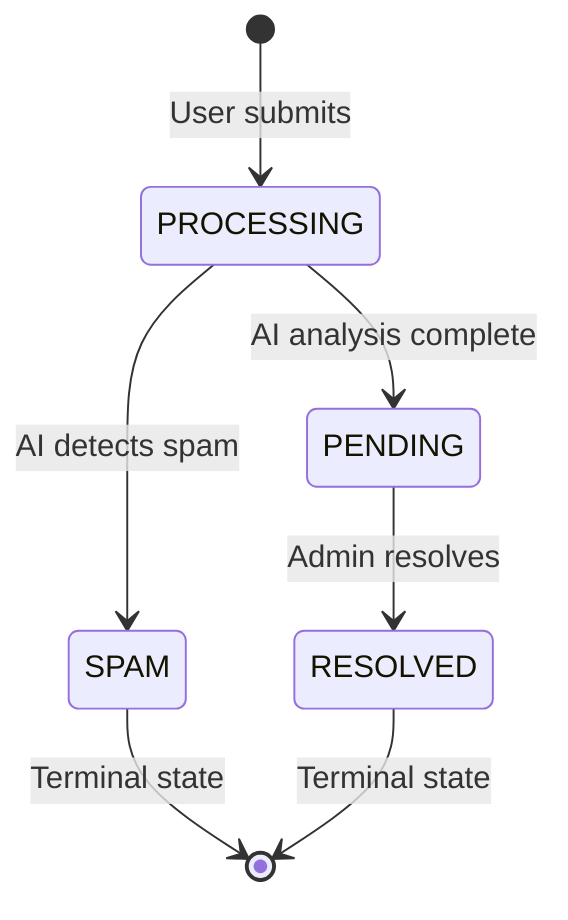
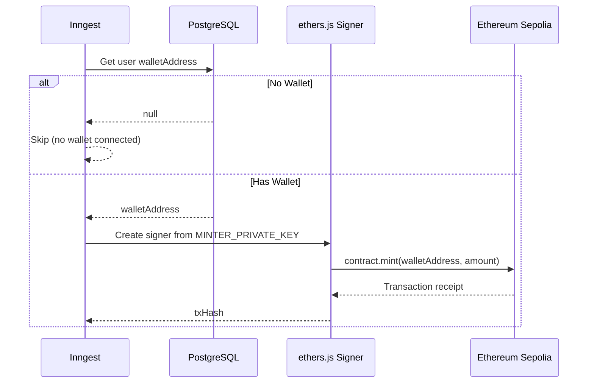

# ✨ Features Documentation

Detailed documentation for every feature module in the EcoSwachh platform.

---

## Table of Contents

- [1. Authentication](#1-authentication)
- [2. Dashboard](#2-dashboard)
- [3. Waste Reporting](#3-waste-reporting)
- [4. Carbon Emission Heatmap](#4-carbon-emission-heatmap)
- [5. Sustainability News Feed](#5-sustainability-news-feed)
- [6. Green Stock Tracker](#6-green-stock-tracker)
- [7. Leaderboard](#7-leaderboard)
- [8. Complaints System](#8-complaints-system)
- [9. Admin — Report Management](#9-admin--report-management)
- [10. Admin — Complaint Management](#10-admin--complaint-management)
- [11. Admin — User Management](#11-admin--user-management)
- [12. Web3 Wallet & EcoToken Minting](#12-web3-wallet--ecotoken-minting)

---

## 1. Authentication

**Feature path:** `features/auth/`

### Overview
Role-based authentication system powered by **Better Auth** with email/password credentials. The system differentiates between `user` and `admin` roles, with each app running its own auth context via cookie prefixing.

### How It Works
- **Registration:** Users sign up with name, email, and password. A `User` record is created with `role: "user"` and `points: 0`.
- **Login:** Authenticated via email/password, creating a session stored in the `session` table with a unique token.
- **Session Management:** Sessions are validated server-side on every protected route via `auth.api.getSession()`.
- **Route Guards:** The `(routes)/layout.tsx` in both apps checks for a valid session and redirects to `/auth/login` if missing.
- **Admin Plugin:** The Better Auth admin plugin enables user management APIs (ban, unban, list users).

### Key Files
| File | App | Purpose |
|---|---|---|
| `lib/auth.ts` | Both | Better Auth server configuration with Prisma adapter |
| `lib/auth-client.ts` | Both | Client-side auth instance for React hooks |
| `features/auth/hooks/` | Both | `useSession`, `useSignOut` hooks |
| `features/auth/ui/` | Both | Login/signup form components |

---

## 2. Dashboard

**Feature path:** `features/dashboard/`

### Overview
The main landing page after login, displaying aggregated metrics for the authenticated user alongside a community leaderboard.

### Metrics Displayed

| Metric | Source | Calculation |
|---|---|---|
| Reports Submitted | `report.count()` | Count of user's reports |
| Waste Reported | `report.aggregate(_sum)` | Sum of `estimatedWeight` |
| Points Earned | `user.findUnique()` | User's `points` field |
| CO₂ Offset | Derived | `wasteReported * 0.5` kg |

### Technical Implementation
- **Server-side prefetching** via `queryClient.prefetchQuery()` in the page server component
- **`HydrationBoundary`** for seamless SSR → client hydration
- **`ErrorBoundary`** + **`Suspense`** wrapping with dedicated loading/error states
- Two independent data streams: dashboard stats + leaderboard table

---

## 3. Waste Reporting

**Feature path:** `features/report/`

### Overview
The core feature of the platform. Users submit waste reports with images and location data, which are processed through a 3-step AI pipeline for spam detection and waste classification.

### User Flow
1. **Upload Image** — User selects/captures a photo, uploaded to ImageKit CDN
2. **Add Description** — Text description of the waste
3. **Set Location** — Either GPS coordinates or manual text entry
4. **Submit** — Creates report in `PROCESSING` status, triggers Inngest pipeline
5. **View Results** — Report updates with AI analysis (title, type, weight, priority, disposal instructions)

### AI Processing Pipeline (Inngest)

| Step | Action | AI Model | Output |
|---|---|---|---|
| 1. Spam Check | Analyzes image + description for legitimacy | GPT-5 Mini | `{ isSpam: boolean, reason: string }` |
| 2a. Mark Spam | If spam → updates status, creates SpamReport | — | Report marked as SPAM |
| 2b. Waste Analysis | If not spam → classifies waste type, priority, weight | GPT-5 Mini | Full analysis object |
| 3. Update Report | Saves AI results to database | — | Report status → PENDING |

### Report Status Lifecycle



### UI Components

| Component | Purpose |
|---|---|
| `AddReport` | Multi-step form with image upload, description, location picker |
| `MyReports` | Paginated list with status/priority filters, cursor pagination |
| `ReportDetail` | Full report view with all AI-generated fields |
| `LocationMapDialog` | Mapbox GL dialog with GPS and direction routing |

### Points System
- **+10 points** on submission (immediate)
- **+20 points** on admin resolution (deferred)

---

## 4. Carbon Emission Heatmap

**Feature path:** `features/carbon/`

### Overview
An interactive Mapbox GL heatmap visualizing real-time carbon emission intensity across Indian grid zones, sourced from the Electricity Maps API.

### Data Coverage

| Zone Code | Region | Major Cities |
|---|---|---|
| `IN-NO` | Northern India | Delhi, Jaipur, Lucknow, Chandigarh |
| `IN-NE` | North Eastern India | Guwahati, Shillong, Imphal |
| `IN-EA` | Eastern India | Kolkata, Patna, Bhubaneswar, Ranchi |
| `IN-WE` | Western India | Mumbai, Ahmedabad, Pune, Nagpur |
| `IN-SO` | Southern India | Bangalore, Chennai, Hyderabad, Kochi |

### Technical Details
- **API:** Electricity Maps v3 (`/carbon-intensity/latest`)
- **Caching:** Upstash Redis, key `carbon:intensity`, TTL 1 hour
- **Visualization:** Mapbox GL JS with heatmap layer
- **Data Unit:** gCO₂eq/kWh (grams of CO₂ equivalent per kilowatt-hour)

---

## 5. Sustainability News Feed

**Feature path:** `features/news/`

### Overview
AI-curated sustainability and waste management news feed with dual data sources: Firecrawl for web scraping and OpenAI for daily AI-generated summaries.

### Two Data Streams

| Stream | Source | Cached Key | TTL |
|---|---|---|---|
| News Articles | Firecrawl web search API | `news:daily` | 24 hours |
| AI Summary | GPT-5 Mini with web search tool | `summary:daily` | 24 hours |

### News Scraping
- Firecrawl searches for sustainability/waste management news
- Returns top 8 articles with summaries and links
- Scraped content includes summaries and external links
- Max age filter: 30 days

### AI Summary
- Uses OpenAI GPT-5 Mini with the `web_search` tool enabled
- Generates a comprehensive daily sustainability summary
- Leverages real-time web access for current information

---

## 6. Green Stock Tracker

**Feature path:** `features/stocks/`

### Overview
Live stock market data for 10 sustainability-focused companies, displayed in a sortable, paginated data table.

### Tracked Companies

| Symbol | Company | Sector |
|---|---|---|
| NEE | NextEra Energy | Utility (Renewables) |
| ENPH | Enphase Energy | Solar Technology |
| FSLR | First Solar | Solar Manufacturing |
| SEDG | SolarEdge Technologies | Solar Technology |
| PLUG | Plug Power | Hydrogen Fuel Cells |
| BE | Bloom Energy | Solid Oxide Fuel Cells |
| RUN | Sunrun | Residential Solar |
| CSIQ | Canadian Solar | Solar Manufacturing |
| NOVA | Sunnova Energy | Residential Solar |
| DQ | Daqo New Energy | Polysilicon Manufacturing |

### Technical Details
- **API:** Finnhub REST API (`/api/v1/quote`)
- **Caching:** Redis key `stocks:quotes`, TTL 2 minutes
- **UI:** TanStack React Table with sorting, column visibility, and pagination
- **Data points:** Current price, change, change%, high, low, open, previous close

---

## 7. Leaderboard

**Feature path:** `features/leaderboard/`

### Overview
Community-wide ranking of users sorted by points earned. Displayed on the dashboard page with a paginated data table.

### How Points Work

| Action | Points | When |
|---|---|---|
| Submit a waste report | +10 | Immediate on submission |
| Report resolved by admin | +20 | When admin resolves the report |

### Table Columns
- Name
- Email
- Role
- Created date
- Points (sorted descending)
- Ban status

---

## 8. Complaints System

**Feature path:** `features/complaint/` (web + admin)

### Overview
A bidirectional communication channel between users and administrators. Users submit complaints (service issues, suggestions, reports on problems), and admins can view, resolve (with comments), or dismiss them.

### User Side
- **Create:** Submit a complaint with title (2-50 chars) and description (5-200 chars)
- **View:** See all personal complaints with status filters
- **Delete:** Remove own complaints

### Admin Side
- **View All:** See all complaints across all users (excluding soft-deleted ones)
- **Resolve:** Add a resolution comment, creates `ComplaintComment` record, updates status to `RESOLVED`
- **Dismiss:** Soft-delete (`deletedForAdmin = true`) — complaint still visible to the user

---

## 9. Admin — Report Management

**Feature path:** `features/report/` (admin)

### Overview
Admins can view all waste reports submitted across the platform, inspect details (including submitter information), and resolve reports.

### Capabilities
- **List View:** All reports with status/priority filters, cursor pagination
- **Detail View:** Full report with AI analysis + submitter's user information
- **Resolve:** Add admin comment, award +20 points to reporter, set status to `RESOLVED`

### Resolution Transaction
The resolve operation is atomic (Prisma `$transaction`):
1. `report.update(status: RESOLVED)`
2. `resolvedReport.create(comment, adminId)`
3. `user.update(points += 20)`

---

## 10. Admin — Complaint Management

**Feature path:** `features/complaint/` (admin)

### Overview
Admin interface for managing community complaints with resolution and soft-delete capabilities.

### Capabilities
- **List View:** All non-deleted complaints with user info and status filters
- **Resolve:** Admin adds comment → creates `ComplaintComment` + updates status to `RESOLVED`
- **Soft Delete:** Sets `deletedForAdmin = true`, removal from admin view only

---

## 11. Admin — User Management

**Feature path:** `features/users/` (admin)

### Overview
Admin-only user moderation tools powered by Better Auth's admin plugin.

### Capabilities
- **List Users:** View all users with role `"user"` sorted by creation date
- **Ban User:** Ban with a required reason (5-200 chars), uses Better Auth's `banUser` API
- **Unban User:** Remove ban status, uses Better Auth's `unbanUser` API

### Authorization
All user management procedures include an explicit role check:
```ts
if (role !== "admin") {
  throw new TRPCError({ code: "UNAUTHORIZED" });
}
```

This is in addition to the `protectedProcedure` middleware that validates session authentication.

---

## 12. Web3 Wallet & EcoToken Minting

**Feature path:** `features/wallet/` + `jobs/mint-tokens.ts`

### Overview
Web3 integration that allows users to connect their Ethereum wallet (MetaMask) and receive ERC-20 EcoTokens on the Sepolia testnet as blockchain-backed rewards for their waste management contributions.

### Wallet Connection Flow

1. **Connect** — User clicks the wallet button in the navbar, chooses MetaMask or an injected provider
2. **Persist** — Once connected, the wallet address is automatically saved to the `User.walletAddress` field via `wallet.saveWalletAddress` tRPC mutation
3. **Display** — The navbar shows a truncated address (e.g., `0x1234...5678`) with a green connection indicator
4. **Network Check** — Warns the user if they're not on the Sepolia testnet (chain ID `11155111`)
5. **Disconnect** — User can disconnect at any time

### EcoToken Minting Pipeline (Inngest)

When a report is resolved by an admin, the platform can trigger an on-chain ERC-20 token mint:

| Step | Name | Description |
|---|---|---|
| 1 | `get-user-wallet` | Fetches the user's stored `walletAddress` from the database |
| 2 | `mint-on-chain` | Creates an ethers.js signer, calls `contract.mint(address, amount)` on the EcoToken contract |

> If the user has not connected a wallet, the minting is skipped gracefully.

### Token Minting Sequence



### Architecture

| Layer | Technology | Purpose |
|---|---|---|
| **Frontend** | wagmi v3 | React hooks: `useAccount`, `useConnect`, `useConnectors`, `useDisconnect` |
| **Connectors** | `injected()`, `metaMask()` | Browser-based wallet providers |
| **Provider** | `WagmiClientProvider` | Wraps app in `WagmiProvider` + `QueryClientProvider` |
| **Chain** | Sepolia (chain ID 11155111) | Ethereum testnet for development |
| **Backend** | ethers.js v6 | Server-side contract interaction via `JsonRpcProvider` + `Wallet` signer |
| **Contract** | ERC-20 (`mint` function) | Custom EcoToken with admin-controlled minting |
| **Orchestration** | Inngest (`token/mint` event) | Durable background minting with 3 retries |

### Key Files

| File | Purpose |
|---|---|
| `lib/wagmi.ts` | wagmi config: Sepolia chain, injected + MetaMask connectors, HTTP transport |
| `lib/wagmi-provider.tsx` | `WagmiClientProvider` — React context wrapper |
| `features/wallet/ui/connect-wallet-button.tsx` | `ConnectWalletButton` — navbar wallet UI |
| `features/wallet/server/wallet-procedures.ts` | `walletRouter` — `saveWalletAddress` + `getWalletAddress` |
| `jobs/mint-tokens.ts` | `mintEcoTokens` — Inngest function for on-chain minting |
| `app/layout.tsx` | Root layout wrapping app in `WagmiClientProvider` |

### Environment Variables Required

| Variable | Scope | Description |
|---|---|---|
| `NEXT_PUBLIC_SEPOLIA_RPC_URL` | Client | Public RPC URL for wagmi HTTP transport |
| `SEPOLIA_RPC_URL` | Server | RPC URL for ethers.js `JsonRpcProvider` |
| `MINTER_PRIVATE_KEY` | Server | Private key of the wallet authorized to mint tokens |
| `ECO_TOKEN_CONTRACT` | Server | Deployed ERC-20 EcoToken contract address on Sepolia |
