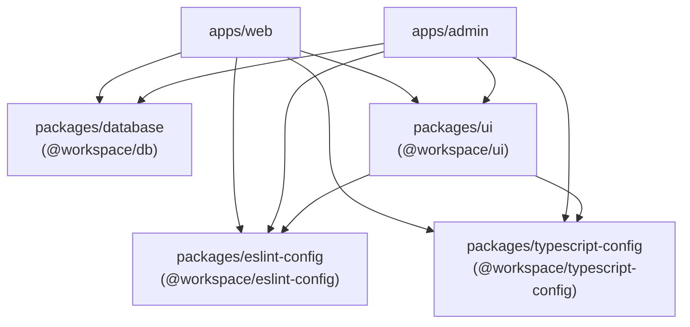

# 📁 Monorepo Structure Guide

This document explains how the EcoSwachh monorepo is organized, how apps and packages relate to each other, and how to create new internal packages.

---

## Workspace Configuration

### Turborepo (`turbo.json`)

Turborepo orchestrates task execution across all workspaces with dependency-aware caching:

```json
{
  "tasks": {
    "build":      { "dependsOn": ["^build", "^db:generate"] },
    "dev":        { "dependsOn": ["^db:generate"], "cache": false, "persistent": true },
    "lint":       { "dependsOn": ["^lint"] },
    "format":     { "dependsOn": ["^format"] },
    "typecheck":  { "dependsOn": ["^typecheck"] },
    "db:generate": { "cache": false },
    "db:migrate":  { "cache": false },
    "db:deploy":   { "cache": false }
  }
}
```

**Key points:**
- `^` prefix means "run this task in all dependencies first"
- `build` and `dev` both depend on `^db:generate` to ensure Prisma client is generated before apps compile
- `dev` is `persistent: true` because it runs long-lived dev servers
- Database tasks are never cached since they have side effects

### pnpm Workspaces (`pnpm-workspace.yaml`)

```yaml
packages:
  - "apps/*"
  - "packages/*"
```

This tells pnpm that any directory under `apps/` or `packages/` is a workspace.

---

## Apps

### `apps/web` — User-Facing Application

| Property | Value |
|---|---|
| Package name | `web` |
| Framework | Next.js 16 with Turbopack |
| Port | 5173 |
| Auth context | Cookie prefix: `web` |

**Internal dependencies:**
- `@workspace/db` — Database access
- `@workspace/ui` — Shared UI components

**Directory structure:**

```
apps/web/
├── app/                    # Next.js App Router
│   ├── (routes)/           # Auth-guarded route group
│   │   ├── _components/    # Dashboard-scoped components
│   │   ├── complaint/      # /complaint page
│   │   ├── my-reports/     # /my-reports and /my-reports/[id]
│   │   ├── news-feed/      # /news-feed with AI summary
│   │   ├── layout.tsx      # Session check → redirect or render sidebar
│   │   └── page.tsx        # Dashboard with SSR prefetching
│   ├── api/                # API route handlers
│   │   ├── auth/[...all]/  # Better Auth catch-all handler
│   │   ├── inngest/        # Inngest webhook endpoint
│   │   ├── trpc/[...trpc]/ # tRPC HTTP endpoint
│   │   └── upload-auth/    # ImageKit authentication endpoint
│   ├── auth/               # Public pages (login, signup)
│   └── layout.tsx          # Root: fonts, providers, metadata
│
├── components/             # App-wide shared components
│   └── shared/
│       ├── navbar.tsx      # Top navigation bar
│       └── sidebar.tsx     # Sidebar with navigation items
│
├── dal/                    # Data Access Layer
│   ├── init.ts             # tRPC setup: context, middleware, procedures
│   ├── routers/_app.ts     # Root router composing all feature routers
│   ├── client.tsx          # Client-side tRPC provider
│   ├── server.tsx          # Server-side tRPC caller
│   └── query-client.ts     # React Query client factory
│
├── features/               # Feature-sliced modules
│   ├── auth/
│   │   ├── hooks/          # useSession, useSignOut, etc.
│   │   └── ui/             # Login form, signup form
│   ├── carbon/
│   │   ├── server/         # carbonRouter: getCarbonIntensity
│   │   └── ui/             # CarbonHeatmap (Mapbox GL)
│   ├── complaint/
│   │   ├── server/         # complaintRouter: create, getAll, delete
│   │   └── ui/             # AddComplaint, MyComplaints
│   ├── dashboard/
│   │   ├── server/         # dashboardRouter: getStats
│   │   └── ui/             # DashboardStats cards
│   ├── leaderboard/
│   │   ├── server/         # leaderboardRouter: getTopUsers
│   │   └── ui/             # LeaderboardTable
│   ├── news/
│   │   ├── prompts/        # Scrapper prompt, AI summary prompt
│   │   ├── server/         # newsRouter + aiRouter
│   │   └── ui/             # NewsFeed, Summary
│   ├── report/
│   │   ├── prompts/        # spam-check.ts, analyze-waste.ts
│   │   ├── server/         # reportRouter: submit, getAll, getById, delete
│   │   └── ui/             # AddReport, MyReports, ReportDetail, LocationMap
│   ├── stocks/
│   │   ├── server/         # stockRouter: getStockQuotes
│   │   └── ui/             # StockTable, StockDataTable, StockTableColumns
│   └── wallet/
│       ├── server/         # walletRouter: saveWalletAddress, getWalletAddress
│       └── ui/             # ConnectWalletButton
│
├── hooks/                  # Global hooks (shared across features)
├── jobs/                   # Background job definitions
│   ├── client.ts           # Inngest client (id: "eco-swachh-web")
│   ├── process-report.ts   # 3-step AI pipeline
│   └── mint-tokens.ts      # ERC-20 EcoToken minting pipeline
├── lib/                    # Utility modules
│   ├── auth.ts             # Better Auth: server config (Prisma adapter)
│   ├── auth-client.ts      # Better Auth: client instance
│   ├── firecrawl.ts        # Firecrawl API client
│   ├── redis.ts            # Upstash Redis client
│   ├── wagmi.ts            # wagmi config (Sepolia, MetaMask, injected)
│   └── wagmi-provider.tsx  # WagmiClientProvider context wrapper
└── public/                 # Static assets (logo.svg, icon.svg, metamask.svg)
```

### `apps/admin` — Admin Management Portal

| Property | Value |
|---|---|
| Package name | `admin` |
| Framework | Next.js 16 with Turbopack |
| Port | 5174 |
| Auth context | Separate Better Auth instance |

**Internal dependencies:**
- `@workspace/db` — Database access
- `@workspace/ui` — Shared UI components

**Directory structure:**

```
apps/admin/
├── app/
│   ├── (routes)/
│   │   ├── complaint/      # Complaint management page
│   │   ├── manage-users/   # User moderation page
│   │   ├── reports/        # Report list and /reports/[id] detail
│   │   ├── layout.tsx      # Admin auth guard + sidebar layout
│   │   └── page.tsx        # Admin dashboard (all reports table)
│   ├── api/
│   │   ├── auth/[...all]/  # Better Auth catch-all
│   │   └── trpc/[...trpc]/ # tRPC endpoint
│   ├── auth/               # Admin login/signup
│   └── layout.tsx          # Root layout with Toaster
│
├── components/shared/      # Sidebar, Navbar
├── dal/                    # tRPC: init, router (_app.ts), client, server
├── features/
│   ├── auth/               # Admin auth hooks & UI
│   ├── complaint/          # Admin complaint: getAll, delete, resolve
│   ├── report/             # Admin report: getAll, getById, resolve
│   └── users/              # User management: getAll, banUser, unbanUser
└── lib/                    # Auth config (cookiePrefix: admin)
```

---

## Packages

### `packages/database` (`@workspace/db`)

The shared database layer consumed by both apps.

```
packages/database/
├── prisma/
│   ├── schema.prisma       # Full schema: 8 models, 3 enums
│   └── migrations/         # Prisma migration history
├── generated/prisma/       # Auto-generated Prisma client (gitignored)
├── src/
│   └── index.ts            # Re-exports: { prisma } + all generated types
├── prisma.config.ts        # Datasource URL from env
└── package.json            # Scripts: db:generate, db:migrate, db:deploy
```

**Usage in apps:**
```ts
import { prisma } from "@workspace/db";          // Client instance
import { User, Report } from "@workspace/db";    // Generated types
```

**Exports map:**
```json
{ ".": "./src/index.ts" }
```

---

### `packages/ui` (`@workspace/ui`)

Shared component library built on Shadcn/UI + Radix UI + Tailwind CSS v4.

```
packages/ui/
├── src/
│   ├── components/         # 19 Shadcn/UI components
│   │   ├── badge.tsx
│   │   ├── button.tsx
│   │   ├── card.tsx
│   │   ├── dialog.tsx
│   │   ├── dropdown-menu.tsx
│   │   ├── field.tsx
│   │   ├── input.tsx
│   │   ├── input-group.tsx
│   │   ├── label.tsx
│   │   ├── select.tsx
│   │   ├── separator.tsx
│   │   ├── sheet.tsx
│   │   ├── sidebar.tsx     # Full sidebar system with rail, collapsible
│   │   ├── skeleton.tsx
│   │   ├── sonner.tsx
│   │   ├── spinner.tsx
│   │   ├── table.tsx
│   │   ├── textarea.tsx
│   │   └── tooltip.tsx
│   ├── hooks/              # Shared hooks (useMobile, etc.)
│   ├── lib/                # Utilities (cn function via clsx + tailwind-merge)
│   └── styles/
│       └── globals.css     # Design tokens, theme variables, base styles
├── components.json         # Shadcn/UI CLI configuration
└── package.json
```

**Exports map:**
```json
{
  "./globals.css":       "./src/styles/globals.css",
  "./postcss.config":    "./postcss.config.mjs",
  "./lib/*":             "./src/lib/*.ts",
  "./components/*":      "./src/components/*.tsx",
  "./hooks/*":           "./src/hooks/*.ts"
}
```

**Usage in apps:**
```tsx
import { Button } from "@workspace/ui/components/button";
import { cn } from "@workspace/ui/lib/utils";
import "@workspace/ui/globals.css";
```

---

### `packages/eslint-config` (`@workspace/eslint-config`)

Shared ESLint configurations:

| Config | File | Purpose |
|---|---|---|
| Base | `base.js` | Core rules for all TypeScript files |
| Next.js | `next.js` | Next.js + React rules for apps |
| React Internal | `react-internal.js` | Rules for internal React packages (UI) |

---

### `packages/typescript-config` (`@workspace/typescript-config`)

Shared TypeScript configurations:

| Config | File | Purpose |
|---|---|---|
| Base | `base.json` | Strict TypeScript with ES2022 target |
| Next.js | `nextjs.json` | Next.js + JSX + plugins |
| React Library | `react-library.json` | React library compilation |

---

## Dependency Graph



---

## 📦 Creating a New Internal Package

Follow these steps to create a new shared package in the monorepo:

### Step 1: Create the Package Directory

```bash
mkdir -p packages/my-package/src
```

### Step 2: Initialize `package.json`

```json
{
  "name": "@workspace/my-package",
  "version": "0.0.0",
  "type": "module",
  "private": true,
  "scripts": {
    "lint": "eslint",
    "typecheck": "tsc --noEmit"
  },
  "dependencies": {},
  "devDependencies": {
    "@workspace/eslint-config": "workspace:*",
    "@workspace/typescript-config": "workspace:*",
    "typescript": "^5.9.3"
  },
  "exports": {
    ".": "./src/index.ts"
  }
}
```

### Step 3: Create `tsconfig.json`

```json
{
  "extends": "@workspace/typescript-config/base.json",
  "compilerOptions": {
    "outDir": "dist",
    "rootDir": "src"
  },
  "include": ["src"]
}
```

### Step 4: Create Entry Point

```ts
// packages/my-package/src/index.ts
export function hello() {
  return "Hello from @workspace/my-package";
}
```

### Step 5: Install & Link

```bash
pnpm install
```

### Step 6: Consume in an App

Add it as a dependency in the consuming app's `package.json`:

```json
{
  "dependencies": {
    "@workspace/my-package": "workspace:*"
  }
}
```

Then add it to `transpilePackages` in the app's `next.config.mjs`:

```js
const nextConfig = {
  transpilePackages: ["@workspace/ui", "@workspace/db", "@workspace/my-package"],
};
```

Import and use:

```ts
import { hello } from "@workspace/my-package";
```

### Step 7: Run pnpm Install Again

```bash
pnpm install
```

The new package will automatically be picked up by Turborepo's task pipeline.

---

## Adding a New Feature Module

To add a new feature to an existing app:

### 1. Create the Feature Directory

```
features/my-feature/
├── server/
│   └── my-feature-procedures.ts    # tRPC router
├── ui/
│   └── my-feature-view.tsx         # React component
└── prompts/                        # (optional) AI prompts
    └── my-prompt.ts
```

### 2. Create the tRPC Router

```ts
// features/my-feature/server/my-feature-procedures.ts
import { createTRPCRouter, protectedProcedure } from "@/dal/init";
import { prisma } from "@workspace/db";
import { z } from "zod";

export const myFeatureRouter = createTRPCRouter({
  getData: protectedProcedure.query(async ({ ctx }) => {
    // Your logic here
    return { data: "hello" };
  }),
});
```

### 3. Register in the App Router

```ts
// dal/routers/_app.ts
import { myFeatureRouter } from "@/features/my-feature/server/my-feature-procedures";

export const appRouter = createTRPCRouter({
  // ... existing routers
  myFeature: myFeatureRouter,
});
```

### 4. Create the UI Component

```tsx
"use client";

import { useSuspenseQuery } from "@tanstack/react-query";
import { useTRPC } from "@/dal/client";

export function MyFeatureView() {
  const trpc = useTRPC();
  const { data } = useSuspenseQuery(trpc.myFeature.getData.queryOptions());

  return <div>{data.data}</div>;
}
```

### 5. Create the Route Page

```tsx
// app/(routes)/my-feature/page.tsx
import { getQueryClient, trpc } from "@/dal/server";
import { dehydrate, HydrationBoundary } from "@tanstack/react-query";
import { Suspense } from "react";
import { ErrorBoundary } from "react-error-boundary";
import { MyFeatureView } from "@/features/my-feature/ui/my-feature-view";

export default async function MyFeaturePage() {
  const queryClient = getQueryClient();
  void queryClient.prefetchQuery(trpc.myFeature.getData.queryOptions());

  return (
    <HydrationBoundary state={dehydrate(queryClient)}>
      <ErrorBoundary fallback={<div>Error</div>}>
        <Suspense fallback={<div>Loading...</div>}>
          <MyFeatureView />
        </Suspense>
      </ErrorBoundary>
    </HydrationBoundary>
  );
}
```

### 6. Add to Sidebar Navigation

Update `components/shared/sidebar.tsx` to include a link to the new route.
